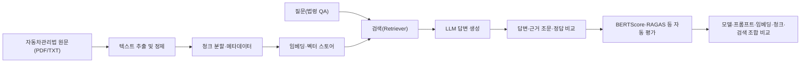

# 4조 자동차관리법 근거응답 RAG

자동차관리법 전문을 지식베이스로 검색하여 **근거가 있는 법령 QA 답변**을 생성하고, RAG에 적용된 LLM·임베딩·문서분할·검색 설정에 따라 여러 조합의 성능을 비교하는 4인 팀 프로젝트입니다.

기존 RAG 실습의 `질문 → 답변 → 종료` 흐름을 다음과 같이 바꿉니다.

```text
법령 원문 입력 → 문서 분할·임베딩·색인 → 질문 → 검색·생성 → 근거 조문 제시 → 정량 평가
```

## 1. 프로젝트 목표

- RAG가 없는 LLM은 그럴듯하지만 근거가 없거나 오래된/틀린 답변을 만들 수 있음을 확인합니다.
- 자동차관리법 조문을 근거로 한 질문-정답(ground truth) 세트를 만들고, 답변이 실제 조문에 부합하는지 평가합니다.
- LLM 종류, Prompt, Embedding 모델, chunk_size/overlap, top_k·벡터스토어·유사도 검색 알고리즘에 따른 품질 차이를 비교합니다.
- 각 담당자가 자신의 변수만 바꾸고 나머지는 고정하여, 최종적으로 팀 전체가 재사용 가능한 RAG 파이프라인과 비교 결과를 정리합니다.

> 이 프로젝트는 법률 자문이 아니며, 실제 자동차 관련 의사결정의 근거로 사용해서는 안 됩니다. RAG 품질·환각(hallucination) 위험성을 설명하기 위한 실습 프로젝트입니다.

## 2. 데이터 범위

### 2.1 주 데이터

`자동차관리법` 전문(most recent 개정본, 2026. 6. 16. 일부개정)을 텍스트로 정리하여 사용합니다.

지식베이스에는 다음 내용이 포함됩니다.

- 자동차 등록(신규·변경·이전·말소등록), 등록번호판
- 자동차 안전기준 및 자기인증, 제작결함 시정(리콜)
- 자동차의 점검·정비·튜닝 및 관련 금지행위
- 자동차검사(신규·정기·튜닝·임시·수리검사), 종합검사
- 자동차관리사업(매매업·정비업·해체재활용업) 및 고지의무
- 이륜자동차 관리, 벌칙·과태료

## 3. 전체 워크플로우



#### 자동 평가

평가 데이터셋(질문-정답)은 12개 이상으로 구성하며, 다음 기준으로 검토합니다.

| 항목 | 질문 |
| --- | --- |
| 정확성 | 정답과 생성 답변이 조문 내용과 일치하는가? |
| 근거성 | 검색된 문맥만으로 답변을 판단할 수 있는가? |
| 명확성 | 법률 비전문가도 이해할 수 있는가? |
| 환각 없음 | 문맥에 없는 내용을 지어내지 않았는가? |
| 응답 속도 | 실서비스로 쓸 수 있는 수준의 응답 시간인가? |

## 4. 4인 역할 분담 (강의 구조 + 평가표 기준)

| 담당 | 실험 변수 | 나머지는 고정 | 평가표 매칭 |
| --- | --- | --- | --- |
| **A: LLM 모델** | LLM 종류(EXAONE, Qwen, Solar, GPT 등) + Prompt | Embedding/chunk/top_k 고정 | RAG/Evaluation (20점) |
| **B: Embedding 모델** | 임베딩 모델(KR-SBERT, bge-m3, e5 등) | LLM/chunk/top_k 고정 | RAG/Evaluation (20점) |
| **C: 문서 처리** | chunk_size, overlap_size, 문서 전처리 전략 | LLM/embedding/top_k 고정 | Document Retrieval (20점) |
| **D: 검색/벡터스토어** | top_k, 벡터스토어(Chroma/FAISS/Pinecone), 유사도 검색 알고리즘 | LLM/embedding/chunk 고정 | Semantic Search (20점) |

### 공동 작업

- 모든 담당자는 같은 지식베이스(`자동차관리법`)와 같은 질문-정답 평가셋을 공유합니다.
- 담당자 간 "고정" 값은 실험이 끝나는 대로 공유하여 서로의 `config`에 반영합니다(예: A의 embedding 고정값 ← B의 최적 결과).
- 평가 지표(BERTScore, 필요 시 RAGAS)와 평가 데이터셋 포맷을 4인이 동일하게 맞춥니다.
- 모델 비교 시 프롬프트와 검색 결과를 동일하게 고정하고, 검색 비교 시 생성 모델과 프롬프트를 동일하게 고정합니다.
- 모든 결과는 실행 파일, 모델명, 파라미터, 실행 시각과 함께 `results/`에 저장합니다.

## 5. 폴더 구조

```
team-04-project/
├── README.md
├── model_a/     # A담당: LLM 모델 + Prompt 비교 (RAG/Evaluation)
├── model_b/     # B담당: Embedding 모델 비교 (RAG/Evaluation)
├── model_c/     # C담당: 문서 분할 전략 비교 (Document Retrieval)
└── model_d/     # D담당: 벡터스토어/검색 알고리즘 비교 (Semantic Search)
```
